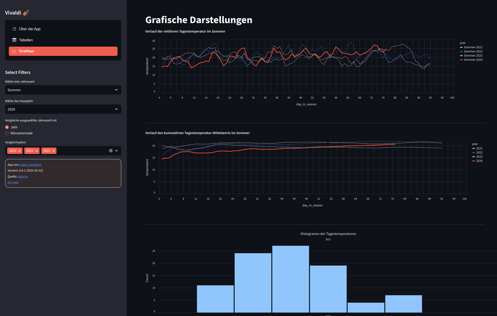

# Vivaldi
**Comparison of Seasonal Data for the Swiss NBCN Weather Station Binningen, Switzerland**

Vivaldi is a data analysis tool designed to extract and compare seasonal weather data from the NSBN weather station in Binningen, Switzerland. The application retrieves daily weather data from the open data portal [data.bs](https://data.bs) and allows users to analyze seasonal trends, which is why it’s aptly named after the famous composer known for "The Four Seasons."

You can try out the application online [here](https://vivaldi.streamlit.app/) or install it locally by following the instructions below.



## Features
- **Data Extraction**: Automatically retrieves daily weather data from [data.bs](https://data.bs).
- **Seasonal Analysis**: Analyze and compare weather data across different seasons.
- **User-Friendly Interface**: Intuitive and easy-to-use interface built with Streamlit.
- **Visualization**: Graphical representation of seasonal trends and comparisons.

## Installation

### On Unix/Linux:
```bash
git clone https://github.com/lcalmbach/vivaldi.git
cd vivaldi
python3 -m venv .venv
source .venv/bin/activate
pip install -r requirements.txt
```

### On Windows:
```bash
git clone https://github.com/lcalmbach/vivaldi.git
cd vivaldi
python -m venv .venv
.\.venv\Scripts\activate
pip install -r requirements.txt
```

### Running the Application
After installing the dependencies, you can run the application locally with the following command:

```bash
streamlit run app.py
```

This will start a local server, and you can access the application by navigating to `http://localhost:8501` in your web browser.

## Contributing
Contributions are welcome! If you find any bugs or have suggestions for improvements, please open an issue or submit a pull request.

### How to Contribute:
1. Fork the repository.
2. Create a new branch (`git checkout -b feature-branch`).
3. Make your changes.
4. Commit your changes (`git commit -m 'Add some feature'`).
5. Push to the branch (`git push origin feature-branch`).
6. Open a pull request.

## License
This project is licensed under the MIT License. See the [LICENSE](LICENSE) file for more details.

